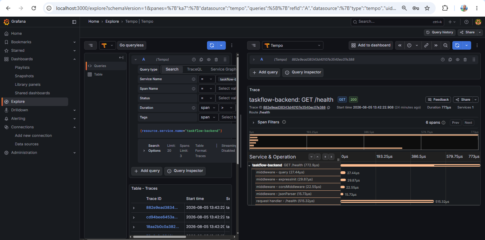
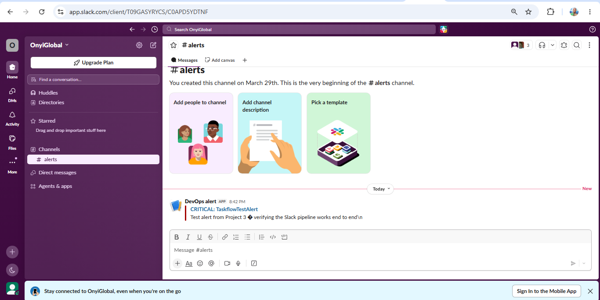
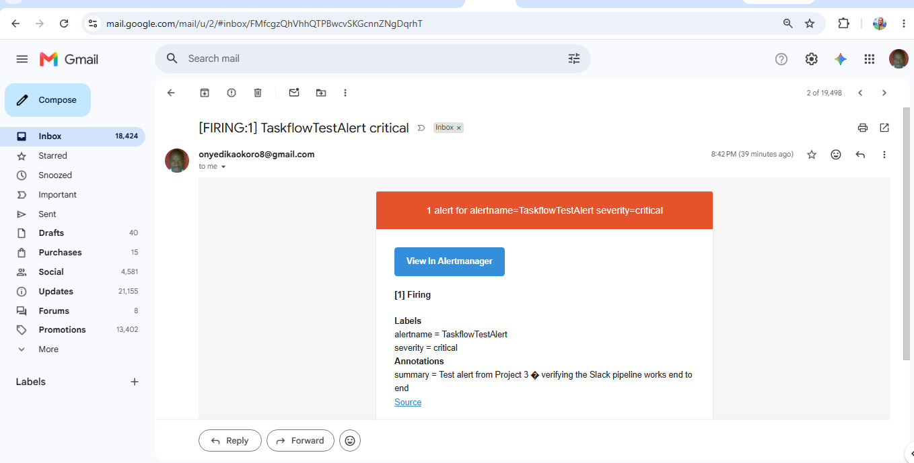
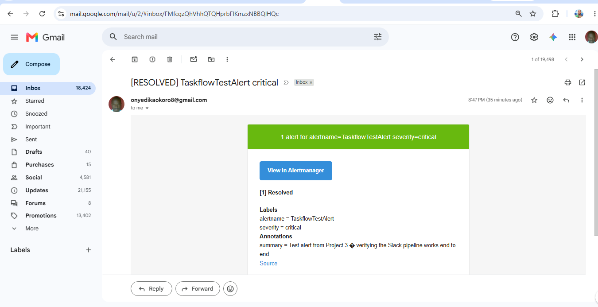
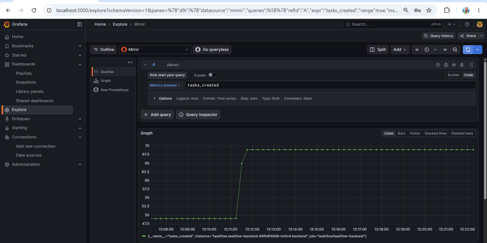
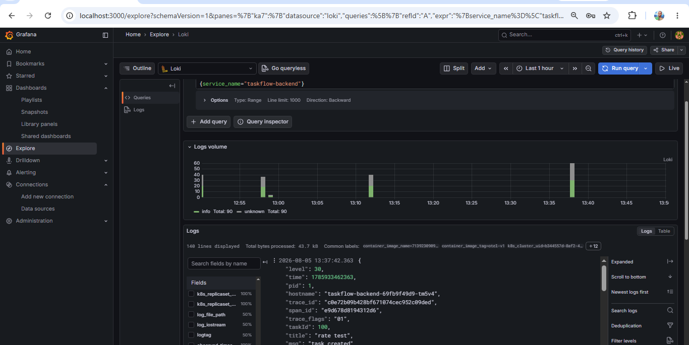
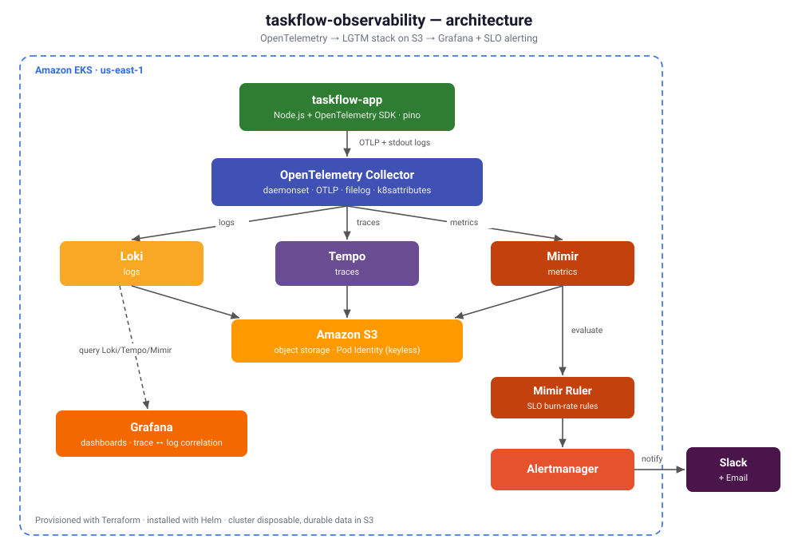

# taskflow-observability


A production-shaped observability platform for a containerized application on Amazon EKS: **distributed tracing, structured logs, and metrics** collected via **OpenTelemetry**, stored in the **Grafana LGTM stack** (Loki, Tempo, Mimir) on **S3**, visualized in **Grafana**, and alerted on with **multi-window burn-rate SLOs** routed to **Slack and email** through **Alertmanager**.

Everything is provisioned with **Terraform** and installed with **Helm**. The cluster is disposable — destroyed and rebuilt each session for cost control, with durable telemetry living in S3.

> This is the platform half of a two-repo system. The application it observes — a Node.js/Express service — lives in [`taskflow-app`](https://github.com/OnyiGlobal2025/taskflow-app) and is instrumented with the OpenTelemetry SDK. This repo owns the pipeline that collects, stores, displays, and alerts on that telemetry.

---

## Highlights

- **All three signals, one pipeline.** Traces, logs, and metrics flow from the app through a single OpenTelemetry Collector to purpose-built backends.
- **Trace ↔ log correlation.** Structured logs carry `trace_id`/`span_id`; a log links directly to its distributed trace in one click.
- **SLO-based alerting.** Multi-window, multi-burn-rate error-budget alerting (the Google SRE pattern), evaluated by the Mimir ruler and delivered to **Slack and email**.
- **Keyless AWS access.** Backends reach S3 through EKS Pod Identity — no static keys, no per-cluster OIDC wiring.
- **Cost-disciplined.** Single-replica backends, S3 object storage, Spot-friendly, torn down between sessions.

---

## Proof

**Distributed trace — a request broken into auto-instrumented spans (Tempo):**



**SLO alert delivered end to end (Alertmanager → Slack):**



**Same alert also delivered to email (Alertmanager → Gmail SMTP):**





> The full alert lifecycle over email: a **[FIRING]** notification at 8:42 PM (same instant as Slack), then an automatic **[RESOLVED]** notification at 8:47 PM once `resolve_timeout` elapsed — `send_resolved: true` closing the loop. Fire → notify → resolve → notify.

**Metrics in Grafana — request rate derived from a live traffic burst (Mimir):**



**Structured logs with trace correlation (Loki):**



---

## Architecture



**Signal paths:**
- **Metrics** — SDK → Collector (OTLP) → Mimir distributor (`/otlp`) → S3
- **Traces** — SDK → Collector (OTLP) → Tempo (OTLP gRPC) → S3
- **Logs** — app writes structured JSON to stdout → Collector filelog receiver → Loki (`/otlp`) → S3
- **Alerts** — Mimir ruler evaluates burn-rate rules → Alertmanager → Slack + email

---

## Stack

| Layer | Technology |
|---|---|
| Infrastructure | AWS EKS (Kubernetes 1.33), VPC, S3, IAM, EKS Pod Identity |
| IaC / packaging | Terraform (EKS module v21, VPC module v6), Helm |
| Instrumentation | OpenTelemetry SDK (Node.js) — auto + manual, pino structured logging |
| Collection | OpenTelemetry Collector (k8s distribution, daemonset) |
| Metrics | Grafana Mimir (S3-backed) |
| Logs | Grafana Loki (S3-backed) |
| Traces | Grafana Tempo (S3-backed) |
| Visualization | Grafana (datasources + trace/log correlation) |
| Alerting | Mimir ruler + Prometheus Alertmanager → Slack + email |

---

## Key engineering decisions

**EKS Pod Identity over IRSA.** IRSA ties each IAM role's trust policy to a specific cluster's OIDC provider URL, which changes on every destroy/rebuild — constant friction for a disposable cluster. Pod Identity uses a generic, cluster-agnostic trust policy and a first-class association resource, so the same roles work across rebuilds with no OIDC wiring.

**S3-backed LGTM, no persistent volumes.** The cluster has no EBS CSI driver and is rebuilt nightly, so backends run with `emptyDir` scratch and push durable data to S3. Storage survives teardown; compute is disposable. This matches how the stack is actually operated and keeps the cluster cheap.

**Daemonset Collector.** Running the Collector as a daemonset lets it tail each node's container logs via the filelog receiver (the logs pillar) while also receiving OTLP from the app and enriching every signal with Kubernetes metadata (`k8s.pod.name`, `k8s.namespace.name`, etc.) for correlation.

**Multi-window, multi-burn-rate SLOs.** Alerts fire on error-budget *burn rate* rather than a raw threshold: a fast window (14.4× over 5m + 1h) pages for sudden outages, a slow window (3× over 1h) warns on gradual degradation. This is the Google SRE approach — fewer false positives, faster real detection. Alertmanager routes by severity: `critical` alerts go to **both Slack and email**; warnings to Slack.

**S3 native state locking, no DynamoDB.** Terraform's remote state uses S3's built-in conditional-write locking (`use_lockfile = true`) instead of the legacy DynamoDB lock table. Since S3 gained strong consistency and conditional writes, the separate DynamoDB table is no longer needed — one fewer resource to provision, pay for, and manage. The state backend itself is a one-time bootstrap with `prevent_destroy`, so it survives the nightly teardown.

**Two-repo separation.** Instrumentation lives in the app repo; the pipeline lives here. This mirrors the real app-team / platform-team split and keeps concerns cleanly divided.

---

## ⭐ War stories

The parts that don't make it into tutorials. Each is a real failure hit during the build, with how it was diagnosed and fixed.

### 1. Loki refused to install — canary and test-hook coupling

**Symptom:** `helm install loki` failed immediately: `INSTALLATION FAILED: execution error ... Helm test requires the Loki Canary to be enabled`.

**Diagnosis:** to keep the footprint lean I disabled the Loki Canary (`lokiCanary.enabled: false`). But the chart has a validation rule: the post-install **Helm test hook** depends on the canary, and the test hook is enabled by *default* — a value never written in my file, inherited from the chart's own defaults. So the config self-contradicted: test-hook on, canary off.

**Fix:** disable the test hook too, so both are consistently off:
```yaml
lokiCanary:
  enabled: false
test:
  enabled: false
```

**Lesson:** a values file is a set of *overrides* on top of chart defaults — a feature can be "on" even when it appears nowhere in your file. Validation errors often reference defaults you never set. When disabling a component, check what else the chart couples to it.

### 2. Trace ↔ log correlation — regex vs. structured metadata

**Symptom:** the Grafana "View Trace" link didn't appear on log lines, even though logs clearly contained a `trace_id`.

**Diagnosis:** the derived field used a regex (`matcherRegex: '"trace_id":"(\w+)"'`) that scans the log *line text*. But Loki, via OTLP ingestion, promoted `trace_id` into **structured metadata** — a real indexed field, not text in the line body. The rendered log line was just `task created`; the regex had nothing to match.

**Fix:** match the structured-metadata field directly instead of regex-scanning the line:
```yaml
derivedFields:
  - name: TraceID
    matcherType: label       # match a field/label, not the line text
    matcherRegex: trace_id
    datasourceUid: tempo
    url: '${__value.raw}'
    urlDisplayLabel: 'View Trace'
```

**Lesson:** OTLP-ingested Loki exposes attributes as structured metadata, not inline text. Correlation config has to target the field (`matcherType: label`), not scan the log body — the difference between a link that renders and one that silently doesn't.

### 3. Mimir's Kafka ingest-storage default silently broke every component

**Symptom:** after deploying Mimir, every component (distributor, ingester, querier…) sat in `CrashLoopBackOff`, plus a `mimir-kafka-0` pod stuck `Pending`.

**Diagnosis:** the pending Kafka pod failed with `unbound immediate PersistentVolumeClaims` (no StorageClass in the cluster). The real trigger was upstream: the chart version defaulted to the **experimental Kafka-based ingest-storage architecture** (`ingest_storage.enabled: true` baked into the config template). The ingesters were configured to receive data *through Kafka* — which would never come up — so they refused to start.

**The trap:** two config flags each fixed half the problem and re-broke the other. Setting `ingest_storage.enabled: false` alone caused `cannot disable Push gRPC method in ingester, while ingest storage is not enabled`. Setting `kafka.enabled: false` alone caused `the Kafka address has not been configured`.

**Fix:** disable the Kafka path *coherently* — all three together:
```yaml
mimir.structuredConfig.ingest_storage.enabled: false
mimir.structuredConfig.ingester.push_grpc_method_enabled: true   # re-enable classic gRPC push
kafka.enabled: false
```

**Lesson:** when a chart ships an experimental architecture as the default, opting out requires flipping *every* coupled flag, not just the obvious one. Read the rendered config, not just the values.

### 4. "No data" in Grafana — an OTLP metric-naming mismatch, not a broken pipeline

**Symptom:** metrics visibly flowed through the Collector into Mimir, but `tasks_created_total` returned **no data** in Grafana.

**Diagnosis:** querying Mimir's label values directly showed the series existed — as `tasks_created`, **not** `tasks_created_total`. OpenTelemetry counters don't get the Prometheus `_total` suffix in this OTLP pipeline; the base name is preserved.

**Fix:** query `tasks_created`. (Also relevant: `rate(tasks_created[5m])` is the right shape for dashboards and SLOs — instantaneous rate, not cumulative total.)

**Lesson:** OTLP→Prometheus naming isn't 1:1. Verify the stored series name at the source before assuming the pipeline is broken — and note the earlier assumption (clearing stale S3 blocks) was a *wrong* diagnosis corrected by checking the data directly.

### 5. The Alertmanager secret saga

**Symptom:** Alertmanager crash-looped with `error loading configuration file ... unsupported scheme "" for URL`.

**Diagnosis:** the Slack webhook, injected as an environment variable, stayed the *literal string* `$SLACK_WEBHOOK_URL` in the rendered config. The chart doesn't reliably expand `$ENV` inside its templated config, so Alertmanager parsed a URL with no scheme and died. Two follow-up approaches (`config.expand-env` via `extraArgs`, then `api_url_file` with `extraSecretMounts`) also failed against this chart's config handling.

**Fix — a two-file pattern that bypasses the chart's config templating:**

1. `am-secret.yml` — the full Alertmanager config (routes, receivers, the *real* Slack webhook). **Gitignored**, never committed.
2. Loaded into a Kubernetes secret: `kubectl create secret generic am-config --from-file=alertmanager.yml=helm/am-secret.yml`
3. `alertmanager-values.yaml` — the committed Helm values (no secrets) that mount that secret and override `--config.file` to read from it:
```yaml
   extraArgs:
     config.file: /etc/secrets/alertmanager.yml
   extraSecretMounts:
     - name: am-config
       secretName: am-config
       mountPath: /etc/secrets
       readOnly: true
```

Both files work together: `alertmanager-values.yaml` deploys the release and points it at the config supplied by the `am-config` secret (built from `am-secret.yml`). Alertmanager reads a config that already contains the real webhook — no `$VAR` expansion involved, so the failure mode simply can't occur.

**Lesson:** when a chart's secret-injection mechanism fights you, bypass it — keep secrets in a gitignored source file + Kubernetes secret, and keep the committed values file pointing at that secret. Two files, clean separation: real values stay out of git, deploy config stays commit-safe. The mounted config carries both receivers, so the same setup delivers to **Slack and email** — confirmed end to end (one test alert, both channels).

### 6. CloudWatch log group survives `terraform destroy` and collides on rebuild

**Symptom:** on a fresh `terraform apply`, EKS creation failed: `creating CloudWatch Logs Log Group (/aws/eks/taskflow-obs/cluster): ... already exists`.

**Diagnosis:** the EKS module auto-creates a control-plane log group that isn't always removed by `terraform destroy`, so the next apply collides with the orphan.

**Fix:** delete the orphaned group before rebuild:
```bash
aws logs delete-log-group --log-group-name /aws/eks/taskflow-obs/cluster --region us-east-1
```

**Lesson:** disposable infrastructure leaks a few stateful resources (log groups, occasionally ENIs). A rebuild routine has to account for what `destroy` leaves behind.

### 7. Git Bash mangles slash-prefixed AWS CLI arguments

**Symptom:** the `delete-log-group` fix above failed with `Value at 'logGroupName' failed to satisfy constraint`.

**Diagnosis:** Git Bash on Windows performs POSIX path conversion, rewriting a leading `/` (`/aws/eks/...`) into a Windows path before it reaches the AWS CLI.

**Fix:** disable path conversion for the command:
```bash
MSYS_NO_PATHCONV=1 aws logs delete-log-group --log-group-name /aws/eks/taskflow-obs/cluster --region us-east-1
```

**Lesson:** on Windows Git Bash, any CLI argument starting with `/` needs `MSYS_NO_PATHCONV=1` (or `//`).

### 8. Multi-tenancy: three backends, three `X-Scope-OrgID` headers

**Symptom:** Loki rejected log pushes with HTTP `401`; Mimir requires a tenant too.

**Diagnosis:** Loki, Tempo, and Mimir are all multi-tenant. Their OTLP endpoints reject writes without an `X-Scope-OrgID` header.

**Fix:** set the tenant header on the Collector's exporters (and the Grafana datasources) for Loki and Mimir.

**Lesson:** the LGTM backends default to multi-tenant; the tenant header has to be set consistently across *every* client — Collector exporters and Grafana datasources alike.

---

## Repository layout

```
terraform/            # VPC, EKS, S3, IAM, Pod Identity
  bootstrap/          #   one-time remote-state backend (S3, native locking)
helm/
  loki-values.yaml    # Loki      (monolithic, S3)
  tempo-values.yaml   # Tempo     (single binary, S3)
  mimir-values.yaml   # Mimir     (minimal distributed, S3, ruler)
  otel-collector-values.yaml
  grafana-values.yaml # datasources + trace/log correlation
  alertmanager-values.yaml  # deploys Alertmanager, mounts the am-config secret
  am-secret.yml       # Alertmanager config w/ real Slack webhook — GITIGNORED
  taskflow-backend/   # minimal chart to run the instrumented app
slo/
  taskflow-slo-rules.yaml   # recording + multi-window burn-rate rules
docs/                 # screenshots
```

Secrets (Slack webhook, config with real values) are kept in gitignored files and Kubernetes secrets — never committed.

---

## Running it

Terraform uses native S3 state locking; the state backend is a one-time bootstrap that survives teardown.

```bash
# 1. Provision infrastructure
cd terraform && terraform apply -auto-approve && cd ..
aws eks update-kubeconfig --region us-east-1 --name taskflow-obs

# 2. Namespaces
kubectl create namespace observability
kubectl create namespace taskflow

# 3. Helm repos
helm repo add open-telemetry https://open-telemetry.github.io/opentelemetry-helm-charts
helm repo add grafana-community https://grafana-community.github.io/helm-charts
helm repo add grafana https://grafana.github.io/helm-charts
helm repo add prometheus-community https://prometheus-community.github.io/helm-charts
helm repo update

# 4. Backends + collector + grafana
helm install loki grafana-community/loki -n observability -f helm/loki-values.yaml
helm install tempo grafana-community/tempo -n observability -f helm/tempo-values.yaml
helm install mimir grafana/mimir-distributed -n observability -f helm/mimir-values.yaml
helm install otel-collector open-telemetry/opentelemetry-collector -n observability -f helm/otel-collector-values.yaml
helm install grafana grafana/grafana -n observability -f helm/grafana-values.yaml

# 5. Alerting (Slack webhook goes in a gitignored secret, not a values file)
helm install alertmanager prometheus-community/alertmanager -n observability -f helm/alertmanager-values.yaml

# 6. The instrumented app
helm install taskflow-backend ./helm/taskflow-backend -n taskflow
```

Access is via `kubectl port-forward` (no public ingress). Tear down with `cd terraform && terraform destroy -auto-approve` — S3 buckets and remote state persist.

---

## What I'd do next

- **Frontend RUM** — browser-side OpenTelemetry for the React app to complete full-stack tracing.
- **EBS CSI driver + persistent volumes** to move beyond `emptyDir` scratch if retention needs grow.
- **Dedup the Collector's self-metrics** so multi-pod daemonset series stop triggering out-of-order handling (currently absorbed by a 10m out-of-order window).
- **GitOps the platform** — manage these Helm releases via ArgoCD rather than imperative `helm install`.

---

## Related

- [`taskflow-app`](https://github.com/OnyiGlobal2025/taskflow-app) — the instrumented application (OpenTelemetry SDK, pino)
- Part of a portfolio building toward Platform Engineer / SRE roles.